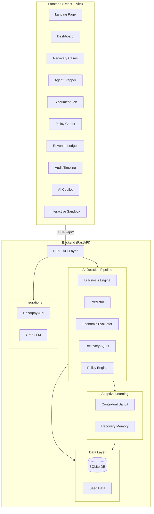
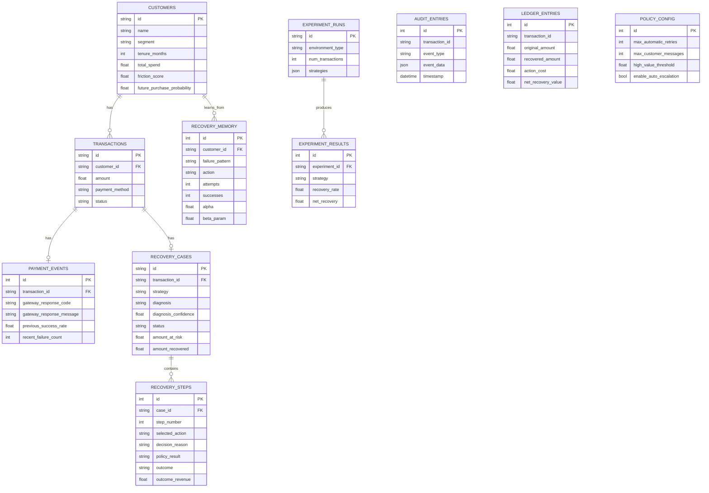

<h1 align="center">🧠 RecoverAI</h1>

<p align="center">
  <strong>Adaptive Revenue Recovery &amp; Customer Retention Engine</strong><br/>
  <em>Autonomous AI agent that turns payment failures into recovered revenue — natively on Razorpay rails.</em>
</p>

<p align="center">
  <a href="#-quick-start">Quick Start</a> •
  <a href="#-architecture">Architecture</a> •
  <a href="#-ai-pipeline">AI Pipeline</a> •
  <a href="#-api-reference">API Reference</a> •
  <a href="#-frontend-pages">Frontend Pages</a> •
  <a href="#-database-schema">Database Schema</a> •
  <a href="#-testing">Testing</a>
</p>

---

## 📖 Overview

**RecoverAI** is an autonomous, adaptive payment recovery platform that intercepts failed transactions and executes intelligent, multi-step recovery workflows. Unlike traditional "blind retry" systems, RecoverAI uses **Bayesian diagnosis**, **economic long-term value optimization**, **contextual multi-armed bandits with Thompson Sampling**, and **deterministic policy guardrails** to decide the best recovery action for each individual transaction — and knows when to *stop*.

### The Problem

- **~14% of online payments in India fail** at checkout (gateway timeouts, expired cards, insufficient funds, bank declines).
- Traditional retry-based systems aggressively re-attempt payments, damaging customer relationships, triggering issuer decline penalties, and recovering only a fraction of at-risk revenue.
- Merchants lose **₹ Crores in annual revenue** with no intelligent recovery mechanism.

### The Solution

RecoverAI deploys an **autonomous AI agent** that:

1. **Diagnoses** the failure cause from raw gateway evidence (not pre-labeled data)
2. **Predicts** success probability for each candidate action using Thompson Sampling
3. **Evaluates** long-term economic value (not just immediate recovery)
4. **Enforces** deterministic merchant policies as hard safety guardrails
5. **Executes** the optimal action — or intelligently **stops** when further recovery hurts the customer relationship
6. **Learns** from every outcome, continuously improving via Bayesian posterior updates

### Key Results (Simulation)

| Metric | Value |
|:-------|:------|
| Revenue at Risk | ₹1,92,127 (25 transactions) |
| Revenue Recovered | ₹1,51,591 |
| Net Recovery Rate | **78.9%** |
| Incremental Lift vs Baseline | +₹27,286 |
| Net Profit Margin | **99.6%** (after deducting ₹668 communication costs) |

---

## 🏗 Architecture

```
RecoverAI/
├── backend/                    # FastAPI + Python backend
│   ├── app/
│   │   ├── main.py             # FastAPI entrypoint & router mounting
│   │   ├── core/               # Configuration & app state management
│   │   │   ├── config.py       # Pydantic settings (env-driven)
│   │   │   └── state.py        # Global app state singleton
│   │   ├── agents/             # AI decision-making agents
│   │   │   ├── recovery_agent.py   # Core adaptive recovery agent
│   │   │   └── baselines.py        # Baseline strategy agents for comparison
│   │   ├── services/           # Business logic & AI services
│   │   │   ├── diagnosis.py          # Bayesian failure cause inference
│   │   │   ├── predictor.py          # Action success probability prediction
│   │   │   ├── economic_evaluator.py # Long-term value calculation
│   │   │   ├── context_builder.py    # Recovery context assembly
│   │   │   ├── action_executor.py    # Action execution against environment
│   │   │   ├── recovery_workflow.py  # End-to-end sequential recovery orchestration
│   │   │   ├── recovery_memory.py    # Pattern memory for learned strategies
│   │   │   ├── experiment_engine.py  # A/B experiment runner
│   │   │   ├── persistence.py        # Database CRUD operations
│   │   │   └── llm_service.py        # Groq LLM integration for explainability
│   │   ├── learning/           # Machine learning
│   │   │   └── contextual_bandit.py  # Thompson Sampling contextual bandit
│   │   ├── policies/           # Safety guardrails
│   │   │   └── policy_engine.py      # Deterministic policy enforcement
│   │   ├── simulation/         # Realistic payment environment simulation
│   │   │   ├── environment.py        # Core simulation environment & actions
│   │   │   ├── environments.py       # Pre-configured environment scenarios
│   │   │   └── transaction_generator.py  # Synthetic transaction generation
│   │   ├── database/           # Data layer
│   │   │   ├── db.py           # SQLAlchemy engine & session factory
│   │   │   ├── models.py       # ORM models (11 tables)
│   │   │   └── seed.py         # Demo data seeder
│   │   ├── integrations/       # External payment integrations
│   │   │   └── payment_provider.py   # Razorpay API integration
│   │   ├── api/                # REST API routers
│   │   │   ├── dashboard.py    # Dashboard metrics
│   │   │   ├── recovery.py     # Recovery workflow endpoints
│   │   │   ├── experiments.py  # Experiment lab endpoints
│   │   │   ├── policies.py     # Policy CRUD
│   │   │   ├── ledger.py       # Revenue ledger
│   │   │   ├── memory.py       # Recovery memory
│   │   │   ├── audit.py        # Audit trail
│   │   │   ├── agent.py        # AI Ops Copilot (Groq LLM)
│   │   │   └── razorpay_api.py # Razorpay checkout & payment link endpoints
│   │   ├── audit/              # Audit subsystem
│   │   └── ledger/             # Ledger subsystem
│   ├── tests/                  # Test suite
│   │   ├── test_recoverai.py   # Core AI pipeline tests
│   │   ├── test_api.py         # API endpoint tests
│   │   └── test_persistence.py # Database persistence tests
│   ├── requirements.txt        # Python dependencies
│   └── recoverai.db            # SQLite database (auto-created)
│
├── frontend/                   # React + TypeScript + Vite frontend
│   ├── src/
│   │   ├── App.tsx             # Root app with routing & global state
│   │   ├── main.tsx            # React DOM entry
│   │   ├── index.css           # Global styles
│   │   ├── api/
│   │   │   └── client.ts       # Typed API client for all backend endpoints
│   │   ├── context/
│   │   │   └── AuthContext.tsx  # Authentication context provider
│   │   ├── types/              # TypeScript type definitions
│   │   ├── pages/              # Application pages (13 pages)
│   │   │   ├── LandingPage.tsx
│   │   │   ├── LoginPage.tsx / SignupPage.tsx
│   │   │   ├── DashboardPage.tsx
│   │   │   ├── RecoveryCasesPage.tsx
│   │   │   ├── TransactionDetailPage.tsx
│   │   │   ├── LiveAgentStepperPage.tsx
│   │   │   ├── ExperimentLabPage.tsx
│   │   │   ├── StrategyComparisonPage.tsx
│   │   │   ├── RecoveryMemoryPage.tsx
│   │   │   ├── PolicyCenterPage.tsx
│   │   │   ├── RevenueLedgerPage.tsx
│   │   │   └── AuditTimelinePage.tsx
│   │   ├── components/         # Reusable UI components (15 components)
│   │   │   ├── Navbar.tsx
│   │   │   ├── Sidebar.tsx
│   │   │   ├── AICopilotDrawer.tsx
│   │   │   ├── CommandPalette.tsx
│   │   │   ├── CustomerTouchpointModal.tsx
│   │   │   ├── DecisionChainFlow.tsx
│   │   │   ├── InteractiveSandbox.tsx
│   │   │   ├── JudgeDemoMode.tsx
│   │   │   ├── LiveActivityTicker.tsx
│   │   │   ├── MetricCard.tsx
│   │   │   ├── ProductTour.tsx
│   │   │   ├── ROICalculator.tsx
│   │   │   ├── RazorpayCheckoutModal.tsx
│   │   │   ├── VisualFinancialCharts.tsx
│   │   │   └── VoiceCommandModal.tsx
│   │   └── assets/             # Static assets
│   ├── public/                 # Public static files
│   ├── index.html              # HTML entry with Razorpay SDK
│   ├── package.json            # NPM dependencies
│   ├── tsconfig.json           # TypeScript configuration
│   └── vite.config.ts          # Vite dev server + API proxy config
│
├── .env.example                # Environment variable template
├── .env                        # Local environment variables (gitignored)
├── pitch_video_script.md       # 5-minute pitch demo script
└── README.md                   # ← You are here
```

### System Architecture Diagram



---

## 🧪 AI Pipeline — 10-Stage Decision Loop

RecoverAI's core intelligence is a **10-stage autonomous reasoning pipeline** that executes for every failed transaction:

### Stage 1: Failure Detection
Raw payment failure intercepted from gateway. The system captures the gateway response code, message, attempt count, and timing data.

### Stage 2: Multi-Signal Bayesian Diagnosis
The **Diagnosis Engine** (`services/diagnosis.py`) infers the failure cause from **8 independent evidence signals**:

| Signal | Weight | Examples |
|:-------|:------:|:--------|
| Gateway response code | 3.0x | `E001` (timeout), `E002` (card expired), `F001` (insufficient funds) |
| Gateway message keywords | 1.5x | "timeout", "expired", "insufficient", "flagged" |
| Historical success rate | 2.0x | 95% success → likely transient; 20% → recurring issue |
| Recent failure count | 1.5x | 3+ recent failures → pattern detected |
| Time since failure | 0.5x | <5 min → still transient; >2 hours → likely persistent |
| Payment method | 0.5x | Card → may expire; UPI → often transient; Wallet → balance |
| Transaction amount | 0.5x | >₹50,000 → fraud risk flag |
| Previous recovery outcomes | 1.5x | 2+ failed recoveries → escalation concern |

**Output:** Diagnosis label (one of 5 categories) with calibrated confidence score and evidence trail.

**Diagnosis Categories:**
- `transient` — temporary gateway/network issue (retry-friendly)
- `expired_credential` — card expired or invalid token (needs alternative payment)
- `insufficient_funds` — balance too low (schedule for later)
- `repeated_failure` — chronic pattern (escalate or stop)
- `fraud_risk` — suspicious activity (immediate escalation)

### Stage 3: Context Assembly
The **Context Builder** (`services/context_builder.py`) assembles a rich `RecoveryContext` object containing:
- Customer profile (segment, tenure, LTV, friction score, purchase probability)
- Transaction details (amount, method, currency)
- Full recovery history (previous actions, outcomes, costs)
- Recovery memory hints (learned patterns for similar cases)

### Stage 4: Thompson Sampling Prediction
The **Contextual Bandit** (`learning/contextual_bandit.py`) samples success probabilities from Beta posterior distributions:

```
P(success | context, action) ~ Beta(α, β)
```

Where `α` and `β` are updated from observed outcomes. This provides natural **exploration-exploitation balance** — the agent tries less-explored actions proportionally to its uncertainty.

### Stage 5: Economic Long-Term Value Evaluation
The **Economic Evaluator** (`services/economic_evaluator.py`) calculates the expected long-term value of each candidate action:

```
LTV(action) = P(success) × txn_value
            + expected_future_customer_value
            - action_cost
            - friction_penalty
```

**Key insight:** The best *immediate* action is often **not** the best *long-term* action. Aggressive retries may recover ₹5,000 now but destroy ₹68,000 in future customer lifetime value.

**6 candidate actions evaluated:**

| Action | Cost (₹) | Friction | Use Case |
|:-------|:--------:|:--------:|:---------|
| `RETRY_NOW` | 5 | 5% | Transient issues, high success probability |
| `RETRY_LATER` | 3 | 2% | Timing-dependent failures, bank downtime |
| `ALTERNATIVE_PAYMENT` | 15 | 3% | Expired cards, offers UPI/NetBanking/Wallet |
| `RECOVERY_MESSAGE` | 8 | 8% | Customer notification via WhatsApp/SMS/Email |
| `ESCALATE` | 50 | 1% | Fraud risk, high-value, repeated failures |
| `STOP` | 0 | -2% | When continuing hurts more than it helps |

### Stage 6: Agent Decision
The **Recovery Agent** (`agents/recovery_agent.py`) selects the optimal action using a multi-factor decision algorithm:

1. **Stop check** — If best action LTV < ₹10 after prior attempts → STOP
2. **Failure escalation** — 3+ attempts with 2+ failures → ESCALATE or STOP
3. **Fraud detection** — Fraud risk confidence > 50% → ESCALATE immediately
4. **High-value conservation** — For transactions > ₹25,000, prefer gentler approaches if LTV is within 85%
5. **Memory-informed override** — If recovery memory shows >60% success rate for an action with comparable LTV → prefer that action
6. **Default** — Select highest LTV action

### Stage 7: Deterministic Policy Guardrails
The **Policy Engine** (`policies/policy_engine.py`) applies **8 hard rules** that the AI **cannot override**:

| Rule | Condition | Result |
|:-----|:----------|:-------|
| Payment already recovered | Previous outcome = SUCCESS | **STOP** |
| STOP always allowed | Agent chose STOP | **ALLOW** |
| Max total attempts | ≥ 5 total recovery attempts | **STOP** |
| High-value threshold | Amount > ₹50,000 | **REVIEW** (human required) |
| Max automatic retries | ≥ 2 retries used | **STOP** retries |
| Max customer messages | ≥ 1 message sent | **STOP** messaging |
| Min retry interval | < 30 min since last attempt | **STOP** |
| Consecutive failures | ≥ 3 consecutive failures | **STOP** (escalate) |

### Stage 8: Action Execution
Execute the approved action against the simulation environment (or live Razorpay APIs).

### Stage 9: Outcome Observation
Record the outcome (SUCCESS, FAILED, PENDING, STOPPED, ESCALATED) with associated revenue, cost, and friction impact.

### Stage 10: Bayesian Learning Update
Update the contextual bandit's Beta distribution posteriors:

```python
if success:
    α += 1  # strengthen belief in this action for this context
else:
    β += 1  # weaken belief
```

The agent becomes **smarter with every transaction** — learning which actions work best for which failure types and customer segments.

---

## 🚀 Quick Start

### Prerequisites

- **Python 3.10+**
- **Node.js 18+** and **npm**
- (Optional) Razorpay test API keys
- (Optional) Groq API key for AI Ops Copilot

### 1. Clone & Configure

```bash
git clone <repository-url>
cd recovery
```

Copy the environment template and configure:

```bash
cp .env.example .env
```

Edit `.env` with your settings:

```env
# Required
DATABASE_URL=sqlite:///./recoverai.db
APP_MODE=simulation
SIMULATION_SEED=42

# Optional — Razorpay Test Mode
RAZORPAY_KEY_ID=rzp_test_xxxxxxxxxxxxx
RAZORPAY_KEY_SECRET=xxxxxxxxxxxxxxxxxxxxxxxx

# Optional — Groq LLM for AI Copilot & Explainability
GROQ_API_KEY=gsk_xxxxxxxxxxxxxxxxxxxxxxxxxxxxxxxxxxxxxxxx
GROQ_MODEL=openai/gpt-oss-120b
```

> **Note:** The app works fully in simulation mode without any API keys. Razorpay and Groq keys unlock additional features (live checkout, AI explanations).

### 2. Start the Backend

```bash
cd backend
pip install -r requirements.txt
python -m uvicorn app.main:app --reload --port 8000
```

You should see:

```
[OK] RecoverAI database initialized & seeded
[READY] RecoverAI backend ready - Simulation Mode
INFO:     Uvicorn running on http://127.0.0.1:8000
```

### 3. Start the Frontend

```bash
cd frontend
npm install
npm run dev
```

The frontend runs on **http://localhost:5173** with automatic API proxying to port 8000.

### 4. Open the App

Navigate to **http://localhost:5173** to see the landing page, or go directly to **http://localhost:5173/dashboard** for the executive dashboard.

---

## 📡 API Reference

Base URL: `http://localhost:8000/api`

### Health Check

```
GET /api/health
```

**Response:**
```json
{ "status": "ok", "mode": "simulation", "version": "1.0.0" }
```

### Dashboard

| Method | Endpoint | Description |
|:------:|:---------|:------------|
| `GET` | `/api/dashboard` | Aggregated dashboard metrics (revenue at risk, recovered, rates, costs) |

### Recovery

| Method | Endpoint | Description |
|:------:|:---------|:------------|
| `POST` | `/api/recovery/run` | Run recovery pipeline on N simulated transactions |
| `GET` | `/api/recovery/cases` | List all recovery cases with summary |
| `GET` | `/api/recovery/cases/{transaction_id}` | Full case detail with step-by-step decision chain |

**Run Recovery — Request Body:**
```json
{
  "num_transactions": 25,
  "environment_type": "stable",
  "seed": 42
}
```

### Experiments

| Method | Endpoint | Description |
|:------:|:---------|:------------|
| `POST` | `/api/experiments/run` | Run A/B experiment comparing strategies |
| `POST` | `/api/experiments/cross-environment` | Compare strategies across multiple environments |
| `GET` | `/api/experiments/results` | Get all past experiment results |

**Strategies available:** `recoverai`, `always_retry`, `fixed_rules`, `immediate_optimizer`

**Environment types:** `stable`, `volatile`, `high_value`, `mixed`

### Policies

| Method | Endpoint | Description |
|:------:|:---------|:------------|
| `GET` | `/api/policies` | Get current merchant policy configuration |
| `PUT` | `/api/policies` | Update policy configuration |

### Revenue Ledger

| Method | Endpoint | Description |
|:------:|:---------|:------------|
| `GET` | `/api/ledger` | Double-entry revenue ledger with all recovery financial records |

### Recovery Memory

| Method | Endpoint | Description |
|:------:|:---------|:------------|
| `GET` | `/api/memory` | View what the agent has learned (per-segment, per-failure patterns) |
| `POST` | `/api/memory/clear` | Clear all recovery memory (reset learning) |

### Audit Trail

| Method | Endpoint | Description |
|:------:|:---------|:------------|
| `GET` | `/api/audit/{transaction_id}` | Immutable audit trail for a specific transaction |

### AI Ops Copilot (Groq LLM)

| Method | Endpoint | Description |
|:------:|:---------|:------------|
| `POST` | `/api/agent/chat` | Conversational AI Ops assistant (natural language queries) |
| `GET` | `/api/agent/explain/{transaction_id}` | LLM-generated explainability for a specific case |

### Razorpay Integration

| Method | Endpoint | Description |
|:------:|:---------|:------------|
| `GET` | `/api/razorpay/config` | Get Razorpay configuration status |
| `POST` | `/api/razorpay/create-order` | Create a Razorpay checkout order |
| `POST` | `/api/razorpay/create-link` | Generate a Razorpay payment link |
| `POST` | `/api/razorpay/verify-payment` | Verify payment after checkout completion |

---

## 🖥 Frontend Pages

### Public Pages

| Page | Route | Description |
|:-----|:------|:------------|
| **Landing Page** | `/` | Product showcase with interactive hero, feature grid, and CTA |
| **Login** | `/login` | Authentication page |
| **Sign Up** | `/signup` | New merchant registration |

### Dashboard Workspace

| Page | Route | Description |
|:-----|:------|:------------|
| **Executive Dashboard** | `/dashboard` | 4 KPI cards, donut charts, interactive failure sandbox, ROI calculator |
| **Recovery Cases** | `/cases` | Filterable table of all recovery cases with status, diagnosis, and outcome |
| **Transaction Detail** | `/cases/:id` | Deep-dive into a single transaction's full decision chain |
| **Live Agent Stepper** | `/stepper` | Visual 10-stage pipeline showing the AI agent's reasoning in real time |
| **Experiment Lab** | `/experiments` | Run A/B tests comparing RecoverAI against baseline strategies |
| **Strategy Comparison** | `/comparison` | Side-by-side visual comparison of strategy performance |
| **Recovery Memory** | `/memory` | Inspect what the bandit has learned (Thompson Sampling posteriors) |
| **Policy Center** | `/policies` | Configure and update merchant policy guardrails |
| **Revenue Ledger** | `/ledger` | Double-entry financial ledger with credits, debits, and net margins |
| **Audit Timeline** | `/audit` | Immutable event timeline for any transaction |

### Interactive Components

| Component | Trigger | Description |
|:----------|:--------|:------------|
| **AI Copilot** | "Ask AI Ops" button | Conversational drawer powered by Groq LLM for ops queries |
| **Command Palette** | `Ctrl + K` | Spotlight search for transactions, pages, and quick actions |
| **Customer Touchpoint** | "Touchpoint" button | Simulates WhatsApp / SMS / Email notifications to customers |
| **Interactive Sandbox** | Dashboard Tab 2 | Simulate any failure scenario and watch the 5-stage pipeline execute |
| **ROI Calculator** | Dashboard Tab 3 | Interactive slider-based merchant ROI and churn projection |
| **Razorpay Checkout** | Via Touchpoint or Sandbox | Official Razorpay checkout modal for live or simulated payments |
| **Product Tour** | First visit or "Tour" button | Guided 1-minute walkthrough of all platform features |
| **Judge Demo Mode** | Navbar | 5-act guided walkthrough designed for demo presentations |
| **Live Activity Ticker** | Dashboard top | Real-time scrolling ticker showing recovery events |

---

## 🗄 Database Schema

RecoverAI uses **SQLite** with **SQLAlchemy ORM** (11 tables):



---

## ⚙️ Configuration

All configuration is managed via environment variables (loaded by Pydantic Settings):

| Variable | Default | Description |
|:---------|:--------|:------------|
| `DATABASE_URL` | `sqlite:///./recoverai.db` | Database connection string |
| `APP_MODE` | `simulation` | `simulation` or `razorpay_test` |
| `SIMULATION_SEED` | `42` | Random seed for reproducible simulations |
| `RAZORPAY_KEY_ID` | *(empty)* | Razorpay test mode Key ID |
| `RAZORPAY_KEY_SECRET` | *(empty)* | Razorpay test mode Key Secret |
| `GROQ_API_KEY` | *(empty)* | Groq API key for LLM-powered features |
| `GROQ_MODEL` | `openai/gpt-oss-120b` | Groq model identifier |

### Policy Configuration (via API or database)

| Policy | Default | Description |
|:-------|:--------|:------------|
| Max Automatic Retries | 2 | Maximum payment retry attempts before blocking |
| Max Customer Messages | 1 | Maximum WhatsApp/SMS/Email notifications per case |
| Min Retry Interval | 30 min | Cooldown between retry attempts |
| Max Recovery Window | 24 hrs | Maximum time allowed for recovery attempts |
| High Value Threshold | ₹50,000 | Transactions above this require human review |
| Max Total Attempts | 5 | Hard limit on total recovery actions per case |
| Auto Escalation | Enabled | Auto-escalate after 3 consecutive failures |

---

## 🧪 Testing

### Run the Full Test Suite

```bash
cd backend
python -m pytest tests/ -v
```

### Test Files

| Test File | Coverage |
|:----------|:---------|
| `test_recoverai.py` | Core AI pipeline — diagnosis, prediction, economic evaluation, agent decisions, policy enforcement, learning updates |
| `test_api.py` | REST API endpoints — health, dashboard, recovery run, cases |
| `test_persistence.py` | Database CRUD — customer/transaction creation, recovery case persistence, ledger entries |

---

## 🔌 Tech Stack

### Backend

| Technology | Version | Purpose |
|:-----------|:--------|:--------|
| **Python** | 3.10+ | Core language |
| **FastAPI** | 0.104.1 | Async REST API framework |
| **Uvicorn** | 0.24.0 | ASGI server |
| **SQLAlchemy** | 2.0.23 | ORM & database management |
| **Pydantic** | 2.5.2 | Data validation & settings |
| **NumPy** | 1.26.2 | Numerical computing (Thompson Sampling) |
| **scikit-learn** | 1.3.2 | ML utilities |
| **httpx** | 0.25.2 | Async HTTP client (Razorpay, Groq API calls) |
| **aiosqlite** | 0.19.0 | Async SQLite driver |
| **SQLite** | Built-in | Zero-config embedded database |

### Frontend

| Technology | Version | Purpose |
|:-----------|:--------|:--------|
| **React** | 19.2 | UI framework |
| **TypeScript** | 6.0 | Type-safe JavaScript |
| **Vite** | 8.2 | Build tool & dev server |
| **TailwindCSS** | 4.3 | Utility-first CSS framework |
| **React Router** | 7.18 | Client-side routing |
| **Recharts** | 3.10 | Data visualization (charts, graphs) |
| **Lucide React** | 1.40 | Icon library |
| **Plus Jakarta Sans** | — | Primary typography |
| **JetBrains Mono** | — | Monospace code font |

### External Integrations

| Service | Purpose |
|:--------|:--------|
| **Razorpay** | Payment checkout, payment links, order creation, webhook verification |
| **Groq LLM** | AI Ops Copilot, case explainability, natural language operations |

---

## 🔄 Simulation Environments

RecoverAI includes pre-configured simulation environments for testing:

| Environment | Description | Characteristics |
|:------------|:------------|:----------------|
| `stable` | Normal payment ecosystem | 70-80% base recovery rate, moderate failures |
| `volatile` | Unstable gateway/network conditions | High transient failure rate, variable success |
| `high_value` | Premium transaction scenarios | Larger amounts, VIP customers, fraud signals |
| `mixed` | Combined real-world scenario | Mix of all failure types and customer segments |

### Baseline Strategies (for comparison)

| Strategy | Description |
|:---------|:------------|
| `recoverai` | Full adaptive agent (diagnosis + economics + bandit + memory) |
| `always_retry` | Blindly retries every failure immediately — industry default |
| `fixed_rules` | Static rule-based approach (if card expired → send link, etc.) |
| `immediate_optimizer` | Optimizes for immediate recovery only (ignores long-term value) |

---

## 📁 Project Scripts

| Script | Command | Description |
|:-------|:--------|:------------|
| Start Backend | `python -m uvicorn app.main:app --reload --port 8000` | Run FastAPI server with hot reload |
| Start Frontend | `npm run dev` | Run Vite dev server on port 5173 |
| Build Frontend | `npm run build` | Production build (TypeScript + Vite) |
| Preview Build | `npm run preview` | Preview production build locally |
| Run Tests | `python -m pytest tests/ -v` | Execute backend test suite |

---


## 🔐 Security & Safety

- **Deterministic Policy Guardrails**: The AI agent *cannot* override merchant-configured policies. All actions pass through the policy engine before execution.
- **Bounded Recovery**: Hard limits on retry count, message count, recovery window, and total attempts prevent runaway automation.
- **High-Value Protection**: Transactions above the configurable threshold (default ₹50,000) automatically require human review.
- **Fraud Detection**: Suspicious transactions flagged by the diagnosis engine are immediately escalated — never auto-retried.
- **Immutable Audit Trail**: Every decision, action, and outcome is recorded in an append-only audit log for full compliance and explainability.
- **Stop Intelligence**: The agent can choose to **STOP** recovery when the expected value of continuing is negative — protecting the customer relationship.

---

## 📄 License

This project is proprietary. All rights reserved.

---

<p align="center">
  <strong>Built with 🧠 by the RecoverAI Team</strong><br/>
  <em>Turning payment failures into recovered revenue, one intelligent decision at a time.</em>
</p>
